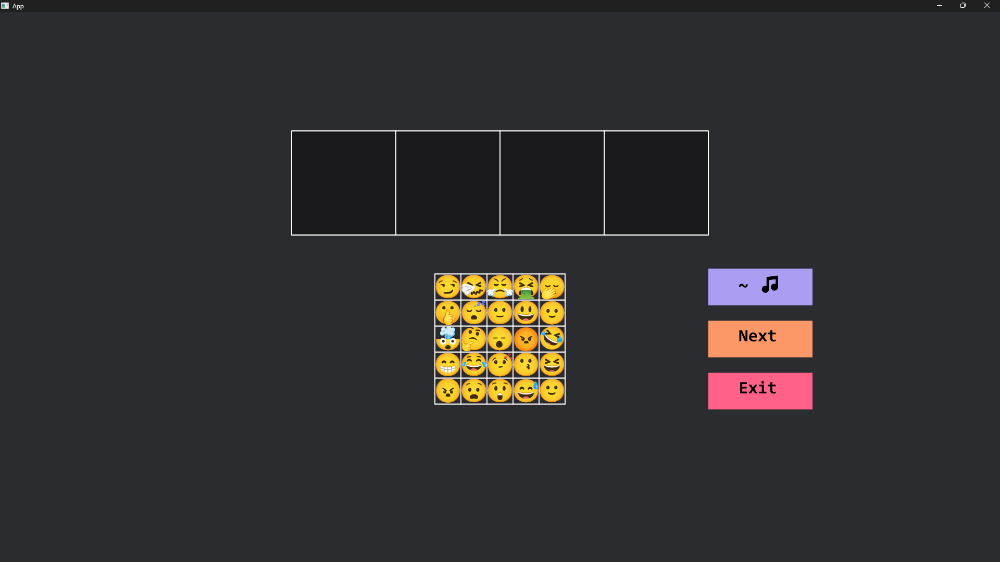
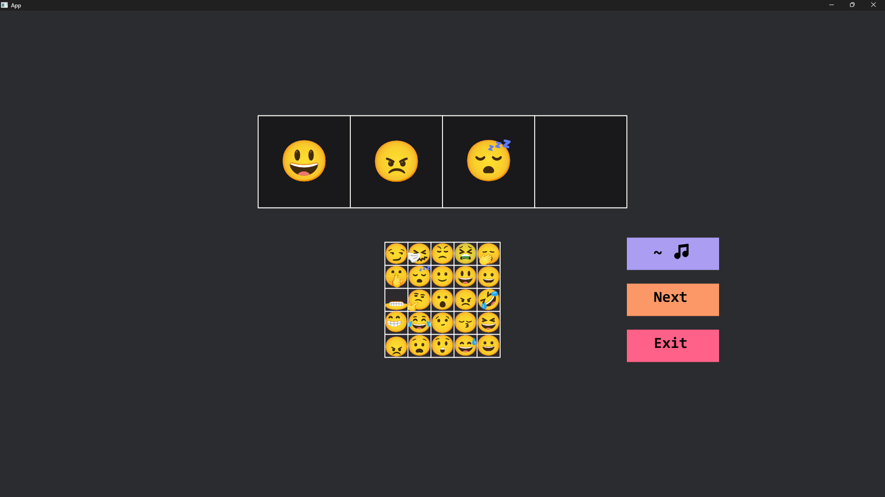

# Moji Moji

Moji Moji is a casual party game where. Players are tasked to guess 4 emojis that are related to the sound (combination of 4 emojis' sound) that is being played.

This game is made using the [Bevy Engine](https://bevyengine.org) and [Bevy MotionGfx](https://github.com/nixon-voxell/bevy_motiongfx).

This game is a submission to the global game jam!

Play it on [itchio](https://chang-kah-boon.itch.io/moji-moji) or [ggj site](https://globalgamejam.org/games/2024/moji-moji-4)

